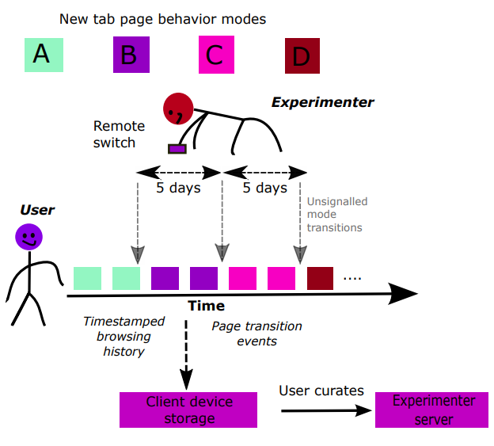

# WebExploration
Code accompanying the paper [New Tab Page Recommendations Strongly Concentrate Web Browsing to Familiar Sources](https://dl.acm.org/doi/pdf/10.1145/3292522.3326011) with authors [Homanga Bharadhwaj](https://homangab.github.io/), and [Nisheeth Srivastava](https://www.cse.iitk.ac.in/users/nsrivast/)


A Firefox Addon that changes the display of the newtab page. The Addon alters the default new-tab page of the web browser by displaying website recommendations under different schemes, namely the most visited sites, the least visited sites, the default high frecency based sites and a blank UI with no websites. We convenience sampled around 100 participants and asked them to use our web-extension for two months. Based on detailed analysis of the browsing logs collected from those participants, we observed that the passive website recommendations embedded in the new tab displays of browsers (that recommend based on frecency) inhibit peoples' propensity to access diverse information sources on the internet.

Requirements
------------

- Python 3
- Javascript
- CSS

Instructions
------------
Zip the files in the repo and follow the instructions in [this](https://extensionworkshop.com/documentation/publish/signing-and-distribution-overview/) link for first `signing` the addon and then `installing` it in the Firefox browser.

Contributors
------------
@homangab

# If you find this repo useful, please consider citing our paper

```bibtex
@inproceedings{bharadhwaj2019new,
  title={New Tab Page Recommendations Strongly Concentrate Web Browsing to Familiar Sources},
  author={Bharadhwaj, Homanga and Srivastava, Nisheeth},
  booktitle={Proceedings of the 10th ACM Conference on Web Science},
  pages={7--16},
  year={2019},
  organization={ACM}
}
```
